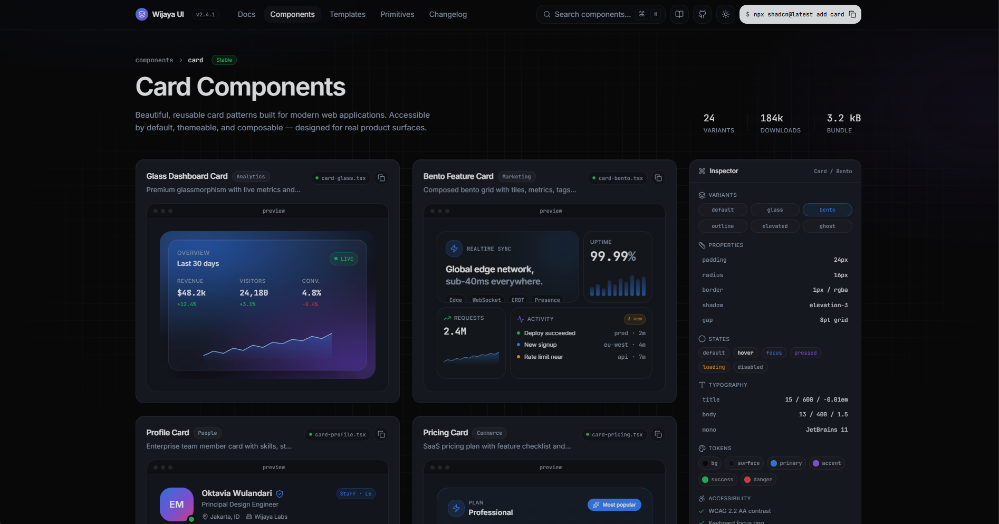

# 🎴Card Components

[](package.json)
[](https://tanstack.com/router/v1/docs/start/overview)
[](https://tailwindcss.com/)
[](https://www.framer.com/motion/)

A premium, highly interactive, and beautifully designed suite of card component patterns. Built with cutting-edge technologies including **TanStack Start**, **Vite**, **Tailwind CSS v4**, and **Framer Motion**. This project serves as an interactive playground demonstrating advanced card architectures, glassmorphism, responsive grids, and detailed design token inspectors.

---


## ✨ Features

- 💎 **Glass Dashboard Card**: Real-time analytics preview showcasing glassmorphism, pulse indicators, metric micro-deltas, and inline SVG charts.
- 🍱 **Bento Feature Card**: A modular grid layout combining custom statistics, feature badges, interactive bars, and real-time activity feeds.
- 👤 **Profile Card**: Enterprise team member showcase with interactive skill tag lists, custom avatar status rings, and complete social links.
- 🏷️ **Pricing Card**: SaaS subscription plan options detailing interactive features, CTAs, highlight badges, and security assurances.
- 🎛️ **Live Inspector**: Interactive sidebar documenting design tokens, typography, colors, padding/radius properties, state styles, and accessibility details.
- 🌓 **Perfect Dark/Light Mode**: Full theme customization powered by Tailwind CSS v4 custom variants.

---

## 🛠️ Tech Stack & Primitives

- **Core & Routing**: [TanStack Start](https://tanstack.com/router/v1/docs/start/overview) (file-based routing & server-side integration), [React 19](https://react.dev/)
- **Build & Dev Server**: [Vite](https://vitejs.dev/)
- **Styling**: [Tailwind CSS v4.0](https://tailwindcss.com/) (using CSS-based configuration), [tw-animate-css](https://github.com)
- **Animations**: [Framer Motion](https://www.framer.com/motion/)
- **Primitives**: Radix UI (Accordion, Dialog, Avatar, Tooltip, Dropdown Menu, etc.)
- **Icons**: [Lucide React](https://lucide.dev/)

---

## 📁 Directory Structure

```bash
├── src/
│   ├── components/
│   │   └── ui/              # Atom level design system primitives (Radix wrappers)
│   ├── routes/
│   │   ├── __root.tsx       # Root layout configuration
│   │   └── index.tsx        # Main showcase workspace containing all Cards & Inspector
│   ├── styles.css           # Global CSS variables, Tailwind configuration & custom utilities
│   ├── router.tsx           # Router configuration
│   ├── start.ts             # Entry point for TanStack Start client
│   └── server.ts            # Entry point for TanStack Start server
├── package.json             # Scripts and dependencies
└── bunfig.toml              # Configuration for Bun runtime (if utilized)
```

---

## 🚀 Getting Started

Ensure you have [Node.js](https://nodejs.org/) (or [Bun](https://bun.sh/)) installed on your machine.

### 1. Clone the repository
```bash
git clone https://github.com/WijayaKusumaa/cardcomponent.git
cd cardcomponent
```

### 2. Install dependencies
```bash
npm install
# or if using Bun:
bun install
```

### 3. Run development server
```bash
npm run dev
# or if using Bun:
bun dev
```
Open `http://localhost:3000` (or the terminal-provided port) in your browser.

### 4. Build and Preview Production Release
```bash
npm run build
npm run preview
```

---

## 🎨 Theme Configuration & Custom Variables

Styling is handled using the brand new **Tailwind CSS v4** `@theme` directive inside [src/styles.css](file:///e:/1.WEBJAY/SelectedProject/UI%20Enggineering/7.cardcomponent/src/styles.css):

```css
@theme inline {
  --radius-sm: calc(var(--radius) - 4px);
  --radius-md: calc(var(--radius) - 2px);
  --radius-lg: var(--radius);

  --font-sans: "Inter", ui-sans-serif, system-ui, sans-serif;
  --font-mono: "JetBrains Mono", ui-monospace, monospace;

  /* Custom Color Tokens mapped to CSS Custom Properties */
  --color-background: var(--background);
  --color-foreground: var(--foreground);
  --color-surface: var(--surface);
  --color-primary: var(--primary);
  --color-secondary: var(--secondary);
}
```

---

## 📝 Code Conventions

This project utilizes TanStack Start's file-based routing mechanism. Paths within the `src/routes/` folder auto-generate routes inside [src/routeTree.gen.ts](file:///e:/1.WEBJAY/SelectedProject/UI%20Enggineering/7.cardcomponent/src/routeTree.gen.ts).

| Route File | Path Mapping |
| :--- | :--- |
| `src/routes/index.tsx` | `/` |
| `src/routes/about.tsx` | `/about` (if added) |

> [!WARNING]
> Do NOT modify `routeTree.gen.ts` manually as it will be overwritten automatically by the TanStack Router compilation process during development or build.

---

## 🛡️ License & Credit

Built and designed with ❤️ by **Wijaya Kusuma**. Feel free to use these card components as a foundation for your own web applications!
